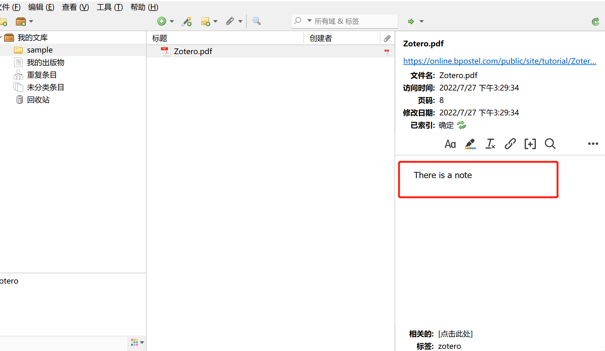

## intro

[quick-start](https://www.zotero.org/support/quick_start_guide)

zotero是一个文献管理工具，它能够帮助你收集，组织，标注，分享你的research资源，最重要的是它免费!(最大优点？)

如果需要视频教程，可以自行搜索(因为没有找到保姆级的教程)。

zotero+浏览器插件，你可以轻松的将文献放入到zotero中管理(只需要到指定的文献下，然后点击zotero的拓展工具，就能存放到你的zotero库中)，每个文献对应一个条目。

导入的文献可以点击查看其地址，访问时间页码等信息(相当于meta-data)。

zotero可以给每个条目添加标签，同时还能添加你看这篇文献总结的笔记(笔记还可以插入图片)。

zotero的文献能上传到网盘中，可以选择你要使用的网盘 ，比如坚果云，腾讯云等等。zotero还能配合各种插件使用。

## drawback

zotero也有缺点：

- 没有影响因子显示
- 没有SCI分区
- 没有中文数据库(如果用知网，需要安装茉莉花插件)
- 中文参考格式需要自己下载，没有内置

